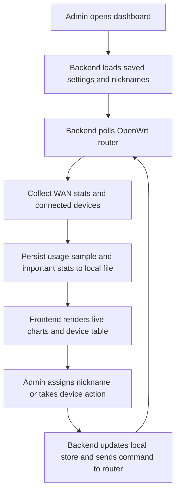

## 1. Product Overview
OpenWrt Usage Monitor is a desktop-first web app that connects to an OpenWrt router, tracks live bandwidth usage, device activity, and policy actions from a single control surface.
- It helps a home or small-office admin see current download/upload rates, identify who is connected, assign readable nicknames to IP or MAC addresses, store usage history locally, and act on unwanted devices.
- Its value is turning scattered OpenWrt status commands into one usable dashboard with persistent history and device management.

## 2. Core Features

### 2.1 User Roles
| Role | Registration Method | Core Permissions |
|------|---------------------|------------------|
| Local Admin | Local app access | View live stats, manage nicknames, disconnect devices, ban devices, export or review saved history |

### 2.2 Feature Module
1. **Dashboard**: live WAN usage cards, download/upload speed charts, health indicators, quick router status.
2. **Devices**: connected client list, search/filter, nickname mapping, per-device activity details, disconnect and ban actions.
3. **History & Settings**: stored usage history, polling controls, file persistence status, router connection settings.

### 2.3 Page Details
| Page Name | Module Name | Feature description |
|-----------|-------------|---------------------|
| Dashboard | Live bandwidth header | Shows current download speed, upload speed, cumulative session totals, last successful poll time |
| Dashboard | Speed graph | Plots recent download/upload samples in real time with selectable time ranges |
| Dashboard | Router health cards | Displays WAN state, uptime, latency sample, packet counters, interface errors, reconnect count if available |
| Dashboard | Storage summary | Shows local history file size, records retained, last write status |
| Devices | Device table | Lists active devices with IP, MAC, hostname, nickname, interface, signal/connection hint, current state |
| Devices | Nickname editor | Lets admin assign or update a nickname for an IP/MAC pair and persist it locally |
| Devices | Device actions | Provides disconnect action for current session and ban/unban action for longer-term blocking |
| Devices | Device details drawer | Shows first seen, last seen, recent usage estimate, router metadata, and ban reason if set |
| History & Settings | Historical usage charts | Displays download/upload history from saved records over selectable windows |
| History & Settings | Important stats log | Stores and surfaces totals, peaks, averages, WAN resets, client counts, router uptime snapshots |
| History & Settings | Router connection setup | Captures OpenWrt host, port, auth method, polling interval, and interface names |
| History & Settings | Persistence controls | Lets admin choose data file location, retention period, and manual export/import |

## 3. Core Process
The admin opens the app, verifies the OpenWrt connection, and lands on a dashboard that auto-refreshes WAN usage and connected device information. The app polls the router on a schedule, stores summarized samples in a local file, merges router-discovered devices with saved nicknames, and renders live charts. When an unknown or unwanted client appears, the admin can rename it, disconnect it for the current session, or ban it so future refreshes keep the policy visible in the UI.

## 4. User Interface Design
### 4.1 Design Style
- Primary colors: charcoal black, graphite, and deep slate with acid green and cyan highlights
- Button style: squared industrial buttons with strong borders, glow on hover, and clear danger styling for ban actions
- Fonts and sizes: a condensed display font for metrics and a highly legible sans-serif for tables and forms
- Layout style: command-center dashboard with large metric panels, dense data grid, and side drawer details
- Icon style suggestions: minimalist network glyphs, port indicators, signal badges, and status dots

### 4.2 Page Design Overview
| Page Name | Module Name | UI Elements |
|-----------|-------------|-------------|
| Dashboard | Live bandwidth header | Oversized numeric counters, status badges, subtle scanline background, timed refresh indicator |
| Dashboard | Speed graph | Dual-line chart with shaded areas, crosshair tooltip, time window switcher, peak markers |
| Dashboard | Router health cards | Compact cards, icon labels, trend deltas, muted background panels |
| Devices | Device table | Sticky header, searchable rows, status chips, action buttons, hover-highlighted rows |
| Devices | Nickname editor | Inline editable field, save feedback state, conflict handling message |
| Devices | Device details drawer | Split metadata blocks, recent activity sparkline, current policy status |
| History & Settings | Historical usage charts | Multi-range chart view, totals strip, retention legend, export buttons |
| History & Settings | Router connection setup | Clear form groups, validation states, test connection action |

### 4.3 Responsiveness
Desktop-first layout with adaptive collapse for tablets, stacked panels on smaller screens, and touch-friendly row actions where possible. Dense monitoring tables remain horizontally scrollable instead of losing information.
