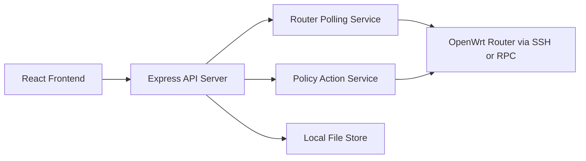
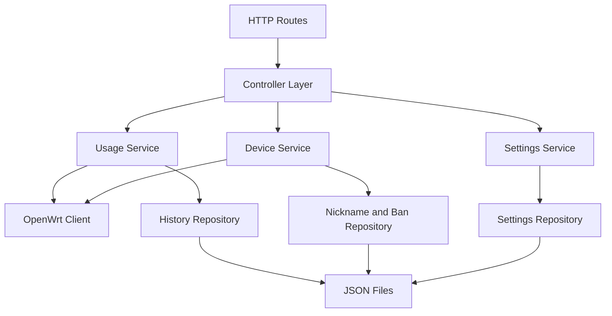
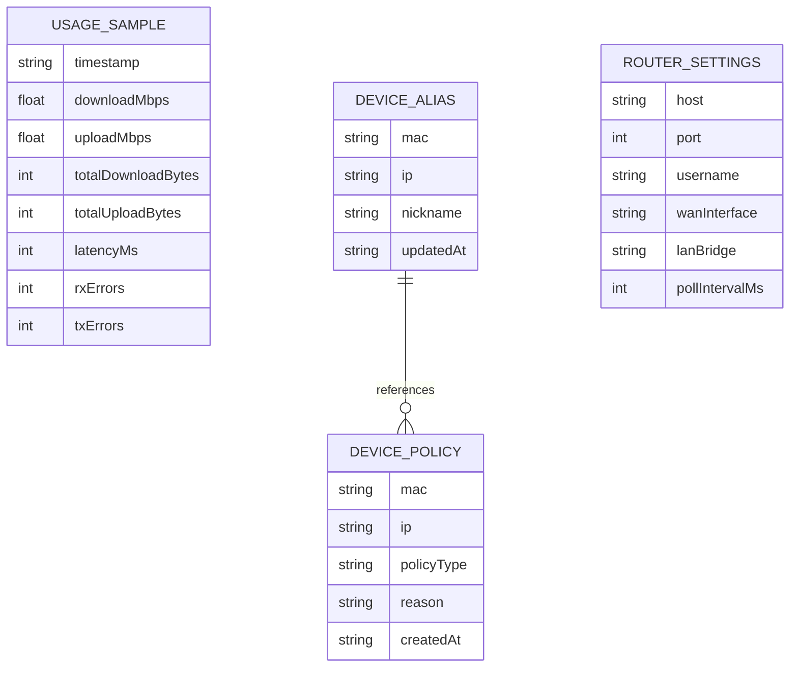

## 1. Architecture Design


## 2. Technology Description
- Frontend: React 18 + TypeScript + Vite + Tailwind CSS 3 + Recharts
- Initialization Tool: Vite
- Backend: Express 4 + TypeScript running in the same project
- Data Store: local JSON files for settings, nicknames, bans, and sampled usage history
- Router Integration: OpenWrt command execution through SSH by default, with abstraction so RPC support can be added later

## 3. Route Definitions
| Route | Purpose |
|-------|---------|
| / | Main dashboard with live usage overview |
| /devices | Connected device list, nicknames, disconnect, and ban controls |
| /history | Historical charts, storage insights, and router settings |

## 4. API Definitions

```ts
type RouterSettings = {
  host: string;
  port: number;
  username: string;
  password?: string;
  privateKey?: string;
  wanInterface: string;
  lanBridge: string;
  pollIntervalMs: number;
};

type LiveUsageSample = {
  timestamp: string;
  downloadMbps: number;
  uploadMbps: number;
  totalDownloadBytes: number;
  totalUploadBytes: number;
  wanUptimeSeconds?: number;
  latencyMs?: number;
  rxErrors?: number;
  txErrors?: number;
};

type ConnectedDevice = {
  id: string;
  ip: string;
  mac: string;
  hostname?: string;
  nickname?: string;
  interface?: string;
  connected: boolean;
  firstSeenAt?: string;
  lastSeenAt?: string;
  recentRxBytes?: number;
  recentTxBytes?: number;
  signalDbm?: number;
  banned: boolean;
};

type ImportantStats = {
  lastUpdatedAt: string;
  activeDeviceCount: number;
  peakDownloadMbps: number;
  peakUploadMbps: number;
  dailyDownloadBytes: number;
  dailyUploadBytes: number;
  wanReconnects?: number;
  lastStorageWriteOk: boolean;
};
```

| Method | Endpoint | Purpose |
|--------|----------|---------|
| GET | /api/overview | Return latest live usage sample, router health, and storage summary |
| GET | /api/usage/live | Return recent live usage samples for charting |
| GET | /api/usage/history | Return historical samples for selected range |
| GET | /api/devices | Return merged connected devices with nickname and ban state |
| POST | /api/devices/nickname | Save or update nickname for IP/MAC mapping |
| POST | /api/devices/disconnect | Disconnect a device from the current session |
| POST | /api/devices/ban | Ban a device and persist the policy locally |
| POST | /api/devices/unban | Remove a device ban and sync router policy |
| GET | /api/settings | Return router and persistence settings |
| POST | /api/settings | Update router and persistence settings |
| POST | /api/router/test | Validate router connectivity and required commands |

### Request and Response Notes
- `POST /api/devices/nickname` accepts `{ ip, mac, nickname }` and returns the updated device record.
- `POST /api/devices/disconnect` accepts `{ mac, ip? }` and returns `{ success, message }`.
- `POST /api/devices/ban` accepts `{ mac, ip?, reason? }` and returns `{ success, message, bannedDevice }`.
- `GET /api/usage/history?range=24h` returns `{ samples: LiveUsageSample[], stats: ImportantStats }`.

## 5. Server Architecture Diagram


## 6. Data Model
### 6.1 Data Model Definition


### 6.2 Data Definition Language
The app uses JSON files rather than a relational database.

```text
data/
  settings.json
  nicknames.json
  device-policies.json
  usage-history.json
  important-stats.json
```

### OpenWrt Integration Notes
- The backend probes for required commands on first connection and records capability flags.
- Primary stats sources are expected to come from commands such as `ip -s link show <wanInterface>`, `ubus call system info`, `ip neigh`, `iwinfo`, and `hostapd_cli`, depending on router support.
- Disconnect actions prefer wireless deauthentication or interface-specific kick commands where available.
- Ban actions persist locally first, then attempt router-side enforcement through hostapd access control, firewall rules, or another supported OpenWrt mechanism based on detected capabilities.
- If a command is unsupported on a router model, the UI surfaces that limitation without breaking the rest of the dashboard.
